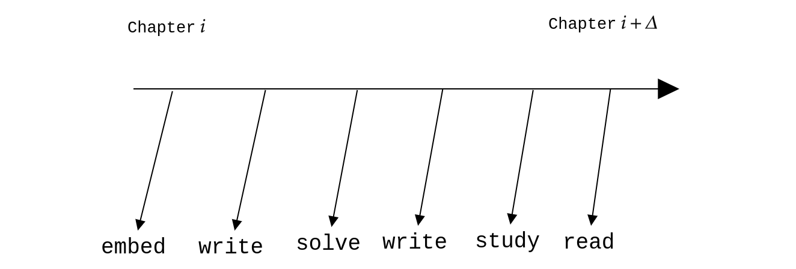

There are six steps in the learning process. Each step is associated with a "learning head". The diagram given below represents a screenshot of the learning process.

- Read
  - Passively engage with the content. Do not target deep understanding. At the same time, ensure that you have a reasonable understanding of what the content is trying to convey. This is the first "learning head" in the learning process and will always be ahead of all other heads.
  - Reading content in advance gives some sort of scaffolding for the mind. The content is let to marinate in the subconscious mind. When a concept is taken up for study (next step), the mind may be better prepared to understand the concept.

- Study
  - This is the step where you actively engage with the content. In the first pass over the content, try to understand what is being conveyed. Close the book and try to recall every detail of what has been studied. This qualifies as immediate recall. If the recall is successful, continue with the next topic. If not, go through a second pass of the content.
  - Immediate recall is a proxy for understanding. If you are not able to completely recall what you have just studied, it shows that you have not understood it properly.
  - Study forms the second head in the process. This will be behind the read-head and will always try to play the catch-up game. As your concentration increases, this step may be subsumed in the reading step. But do not assume that this will happen any time soon. It might take several years of dedicated study before anything like this happens.

- Write
  - Understanding is only part of the learning process. It is good enough to ensure short-term recall. The first step to ensure long-term recall is to take notes or to write down what you have understood.
  - When you are able to write about something in your own words in as clear a language as possible, you have understood it quite well.
  - Make your notes as atomic as possible. Stick to markdown for now. Let there be a folder for each subject. Dump all the notes for that subject in into that folder.
  - Give a good title for each note.
  
- Solve
  - Solve the exercise problems at the back of each chapter/section. Don't try to solve every single problem. Try to solve as many as you can.
  - Do not look at the solution immediately.

- Write
  - Write down the solutions to these problems meticulously. Writing down the solution might expose gaps in the solution process.

- Embed
  - Use a spaced repetition tool like Anki to embed the content you have learnt into your long-term memory.
  - Let this step happen only after you have spent enough time with the content. Ankification of a topic should start only after you have written notes on it and solved at least a couple of problems on it. 
  - Premature Ankification can be a problem since you will be reviewing these cards quite often. You only want to remember the best possible representation of a concept. "You are what you remember."

This learning process should be used to master the entire learning resource. This is a local behaviour. Once this is complete or nears completion, you can move on to the global process.

- Graph
  - After covering several topics, start constructing a graph that maps concepts.
  - This should be your own map that emerges from your understanding of the content.

- Intuit
  - Intuition will kick in slowly after you have spent a sufficient amount of time with the content.
  - This is the highest form of learning.

Each pointer will have a temporal dependence on other pointers. But each pointer's relationship with the content is linear. For example, reading will proceed sequentially, one topic after the other. Likewise, problem solving will proceed sequentially, one problem after the other in each topic that has already been studied.
